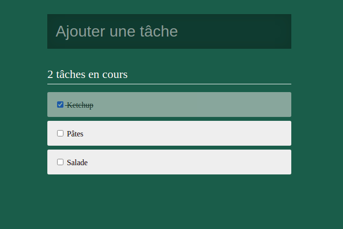

# Challenge ToDoList

Ce projet est un challenge que j'ai effectué pendant ma [formation O'Clock](https://oclock.io/formations/developpeur-web-fullstack-javascript), durant le mois de spécialisation React.\
Il s'agissait de créer une To Do List avec **React**.



## Technologies

- React.js
- Javascript
- Sass

## Installation

```
git clone https://github.com/Nina-petit/Formation-ToDoList.git
cd Formation-ToDoList
npm install
npm start
```

## Fonctionnalités

- Pouvoir ajouter une tâche grâce à la barre de recherche
- Pouvoir cocher et décocher une tâche
- Ordonner les tâches: en haut, les tâches non effectuées; ensuite, les tâches effectuées
- Afficher un compteur de tâches à effectuer